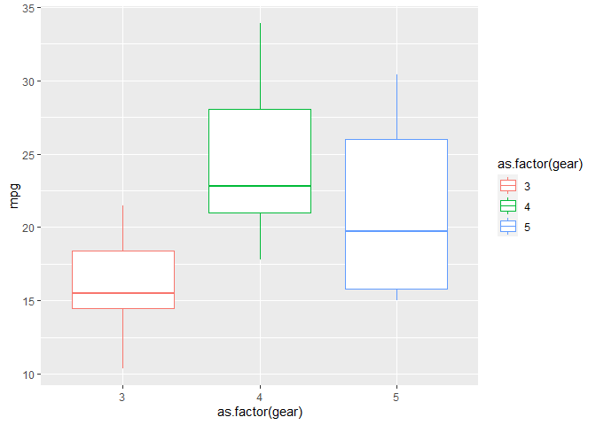
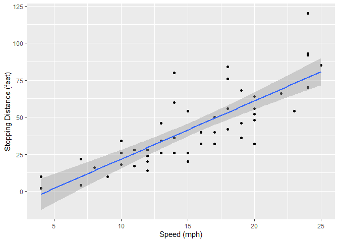
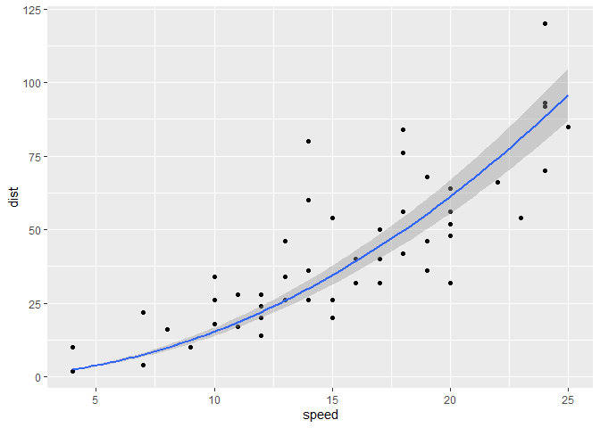

Advanced Bioinformatics 2019 assessment
================
m1606654
10/04/2020

Task 3.1

``` r
sum(5:55) 
```

    ## [1] 1530

Task 3.2 \#ASSIGNS sumfun as a function that takes n as an imput but
always calculates the sim of all integers between 5 and n)

``` r
sumfun <- function(n) {sum(5:n)}
sumfun(10)
```

    ## [1] 45

``` r
sumfun(20)
```

    ## [1] 200

``` r
sumfun(100)
```

    ## [1] 5040

Task 3.3 \#This states that n is equal to 12 and that our desired length
for the fibonnaci sequence is equal to n \#Then we can use a for-loop to
add one to the first element of x, add two to the second element of x
and so on. We use the variable n to store the number of elements in x.
In the loop, we will use the variable x to loop through the first 12
numbers. \# This for-loop creates a vector with 12 components where each
component is added to the previous one

``` r
n <- 12
fibonacci <- numeric(n)
fibonacci[1] <- 1
fibonacci[2] <- 1
for (x in 3:n)
{fibonacci[x] <- fibonacci[x-1]+fibonacci[x-2]} 

fibonacci
```

    ##  [1]   1   1   2   3   5   8  13  21  34  55  89 144

Task 3.4

``` r
library(ggplot2)
ggplot(data=mtcars,aes(x=as.factor(gear),y=mpg)) + geom_boxplot(aes(col=as.factor(gear)))
```

<!-- -->

Task 3.5 Fitted slope: 3.9342 Std. Error = 0.4155 Intercept: -17.5791
Std. Error = 6.7584 Variables: Speed: (mph) Distance: (feet)

``` r
linearMod <- lm(dist ~ speed, data = cars)
summary(linearMod)
```

    ## 
    ## Call:
    ## lm(formula = dist ~ speed, data = cars)
    ## 
    ## Residuals:
    ##     Min      1Q  Median      3Q     Max 
    ## -29.069  -9.525  -2.272   9.215  43.201 
    ## 
    ## Coefficients:
    ##             Estimate Std. Error t value Pr(>|t|)    
    ## (Intercept) -17.5791     6.7584  -2.601   0.0123 *  
    ## speed         3.9324     0.4155   9.464 1.49e-12 ***
    ## ---
    ## Signif. codes:  0 '***' 0.001 '**' 0.01 '*' 0.05 '.' 0.1 ' ' 1
    ## 
    ## Residual standard error: 15.38 on 48 degrees of freedom
    ## Multiple R-squared:  0.6511, Adjusted R-squared:  0.6438 
    ## F-statistic: 89.57 on 1 and 48 DF,  p-value: 1.49e-12

Task 3.6

``` r
library(ggplot2)
ggplot(cars,aes(speed,dist))+ geom_point() + geom_smooth(method="lm",formula="y~x") + labs(x="Speed (mph)",y="Stopping Distance (feet)")
```

<!-- -->

Task3.7 First create a model whereby braking distance is proportional to
velocity squared. Then use summary to find the residuals (differences
between observed points and predicted points). Find the average of the
residuals Calculate reaction time Plot the reaction time model

``` r
reaction_time_model <- lm(dist ~ I(speed^2)+0, data = cars)
summary(reaction_time_model)
```

    ## 
    ## Call:
    ## lm(formula = dist ~ I(speed^2) + 0, data = cars)
    ## 
    ## Residuals:
    ##     Min      1Q  Median      3Q     Max 
    ## -29.350  -7.988   1.325   8.080  49.939 
    ## 
    ## Coefficients:
    ##            Estimate Std. Error t value Pr(>|t|)    
    ## I(speed^2) 0.153374   0.007122   21.54   <2e-16 ***
    ## ---
    ## Signif. codes:  0 '***' 0.001 '**' 0.01 '*' 0.05 '.' 0.1 ' ' 1
    ## 
    ## Residual standard error: 15.61 on 49 degrees of freedom
    ## Multiple R-squared:  0.9044, Adjusted R-squared:  0.9025 
    ## F-statistic: 463.8 on 1 and 49 DF,  p-value: < 2.2e-16

``` r
resdata <- reaction_time_model$residuals
print(resdata)
```

    ##            1            2            3            4            5            6 
    ##  -0.45398004   7.54601996  -3.51531389  14.48468611   6.18407982  -2.42327398 
    ##            7            8            9           10           11           12 
    ##   2.66262472  10.66262472  18.66262472  -1.55822409   9.44177591  -8.08582040 
    ##           13           14           15           16           17           18 
    ##  -2.08582040   1.91417960   5.91417960   0.07983578   8.07983578   8.07983578 
    ##           19           20           21           22           23           24 
    ##  20.07983578  -4.06125555   5.93874445  29.93874445  49.93874445 -14.50909438 
    ##           25           26           27           28           29           30 
    ##  -8.50909438  19.49090562  -7.26368071   0.73631929 -12.32501456  -4.32501456 
    ##           31           32           33           34           35           36 
    ##   5.67498544  -7.69309590   6.30690410  26.30690410  34.30690410 -19.36792476 
    ##           37           38           39           40           41           42 
    ##  -9.36792476  12.63207524 -29.34950111 -13.34950111  -9.34950111  -5.34950111 
    ##           43           44           45           46           47           48 
    ##   2.65049889  -8.23289635 -27.13471522 -18.34328161   3.65671839   4.65671839 
    ##           49           50 
    ##  31.65671839 -10.85859549

``` r
mean(resdata)
```

    ## [1] 2.40344

``` r
library(ggplot2)
ggplot(cars,aes(speed,dist))+geom_point()+geom_smooth(method="lm",formula = "y~I(x^2)+0")
```

<!-- -->
